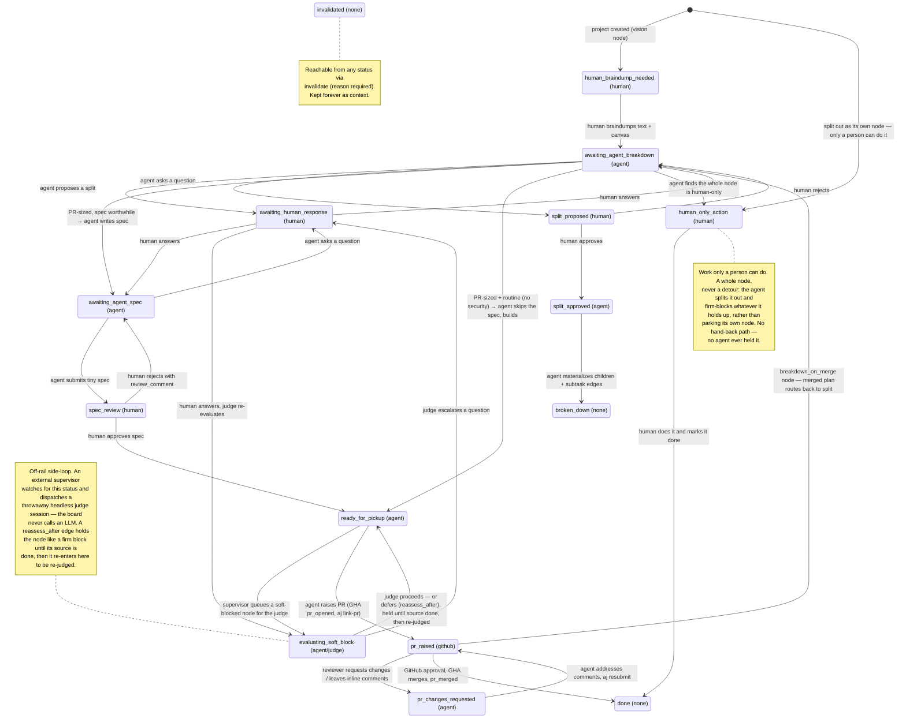
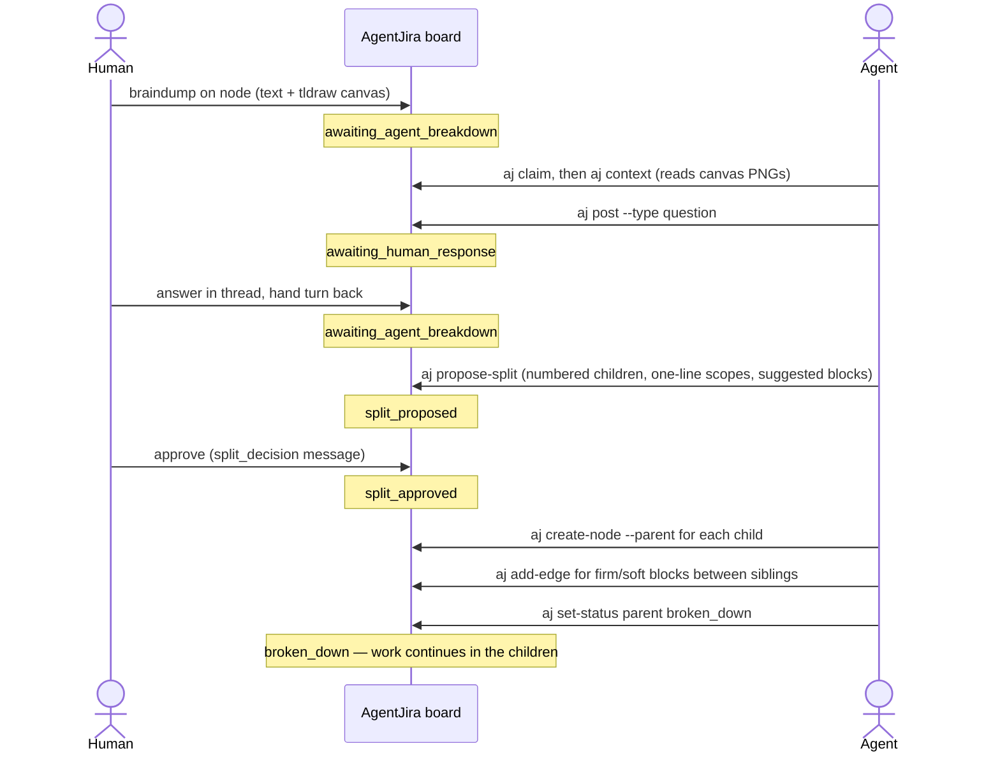
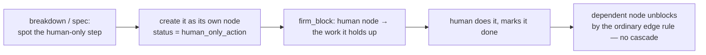
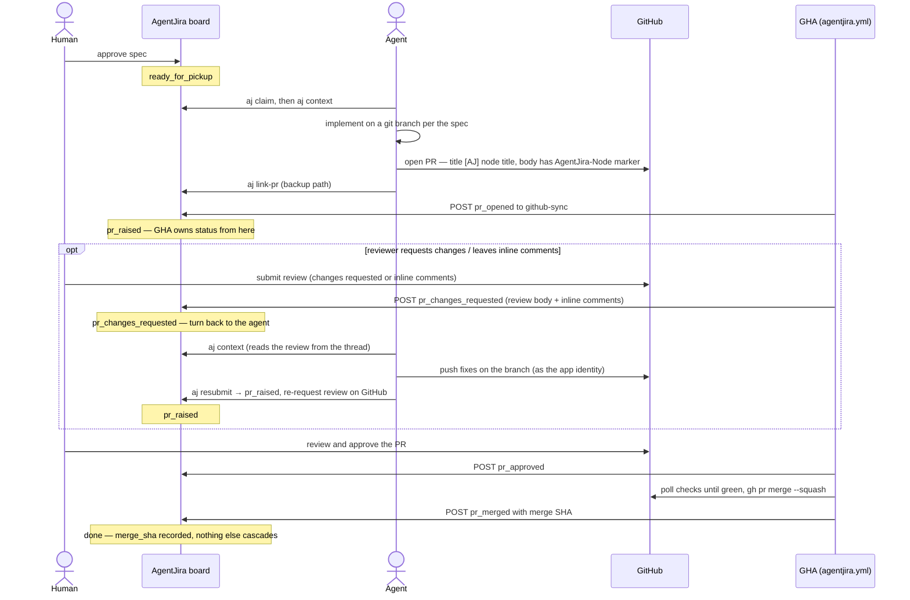
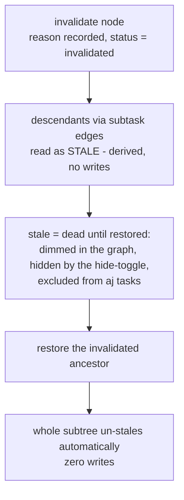

# AgentJira — Workflow Stages

How a node moves from braindump to merged PR. Exact names and rules live in [architecture.md](architecture.md); this page is the picture. Colors in the app follow one rule: **brighter = human needed**.

## The status machine

Every node is in exactly one status, and each status belongs to a turn: **human**, **agent**, **github**, or **none** (terminal/container).

Two loops in that diagram are easy to miss:

- **The soft-block judge** (`evaluating_soft_block`). A soft-blocked node is queued for an external, throwaway **judge** session that decides: proceed, escalate a question to the human (which returns here for re-judging once answered), or defer via a `reassess_after` edge — which gates the node exactly like a firm block until its source is `done`, then routes it back through the judge. The board never calls an LLM; a deterministic supervisor just watches for the status and dispatches the session. Detail: `agentjira-workflow` rulebook + [architecture.md](architecture.md).
- **Breakdown-on-merge re-entry** (`pr_raised → awaiting_agent_breakdown`). A node flagged `breakdown_on_merge` delivers a plan/spec document, so its PR merge routes it back to breakdown (recording the `merge_sha`) instead of `done` — the planned work still has to be split into tasks.

Orthogonal to status: **stale** (derived at read time, never stored — an ancestor via subtask edges is currently `invalidated`; the node is dead until that ancestor is restored) and `claimed_by` (an agent session is actively on it; humans clear stuck claims from the UI).

## The breakdown loop

The top half of a node's life: human braindumps, agent asks, human answers, agent proposes a split, human approves, agent materializes.

The question loop can repeat as often as needed — regular human intervention is the point, not a failure mode. Children that are already PR-sized skip further splitting: the agent then judges whether a spec is worthwhile ("would human guidance on the plan help here?") — routine, self-evident work skips straight to `ready_for_pickup` and builds, so the PR review is the human's only gate on it; anything where the plan is worth a look, and **all security-relevant work** (auth, secrets, permissions, RLS, migrations, config), goes through `awaiting_agent_spec` → `spec_review`. This is deliberate load control: the spec gate exists where human guidance adds value, not as a rubber stamp on obvious work.

## Human-only work

Some work is blocked on being a person: creating an account, paying for something, clicking through a third-party console, plugging in hardware, signing a document. No amount of context unblocks it, so it does not belong in an agent's queue at all.

The rule is **split it out, don't wait on it**. The human-only step becomes its own node in `human_only_action`, and whatever it holds up is firm-blocked by that node — the same dependency machinery as everything else. An agent never parks its own node hoping a human wanders past.

- **Predict them, don't discover them.** Breakdown and spec are where these steps are cheap to spot, and a split proposal should name the human-only children explicitly. Running into one mid-implementation is the fallback: the agent splits it out, blocks its own node on it, and goes and does something else rather than stalling.
- **The whole node is the human's, start to finish.** There is no hand-back, because no agent ever held it. The human marks it `done` — or `invalidated` if it turns out to be unnecessary.
- **It is loud on purpose.** Bright red card, never listed by `aj tasks`, and any firm block from it reads as unfinished everywhere until the human acts. That is exactly the truth: nothing downstream can move.

## The PR endgame

The bottom half: spec approved, agent implements, GitHub review is the final human gate, the GHA does the rest.

Post-merge, nothing auto-advances: dependents' "unblocked" state is derived from edges, never cascaded writes.

## Invalidation and staleness

When a premise turns out wrong, the node is **invalidated** (reason required, recorded forever). Everything built on it reads as **stale** — derived at read time, nothing is written to the descendants:

- A node is stale iff its own status is not `invalidated` and an ancestor via non-removed `subtask` edges currently is. The walk (server: `stale_node_ids`; web: derived in the view) is cycle-safe and depth-capped at 50. Even `done` descendants read as stale — a merged premise can still be stale.
- **Blocks never affect staleness.** A blocker's status (including `invalidated`) is visible wherever blockers are listed; that's the whole signal.
- Stale renders as the dimmed invalidated card treatment plus a solid amber STALE badge; invalidated ancestors are flagged in every descendant's breadcrumb.
- **Invalidated nodes are not trash.** They stay first-class, readable, and searchable — the invalidation reason is exactly the context that stops the next agent repeating the mistake. Nothing is ever deleted.
